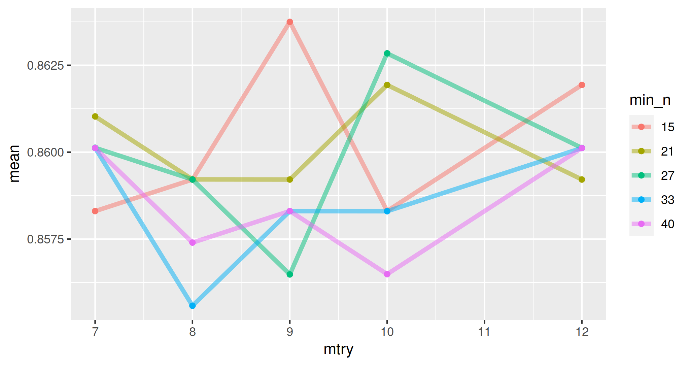
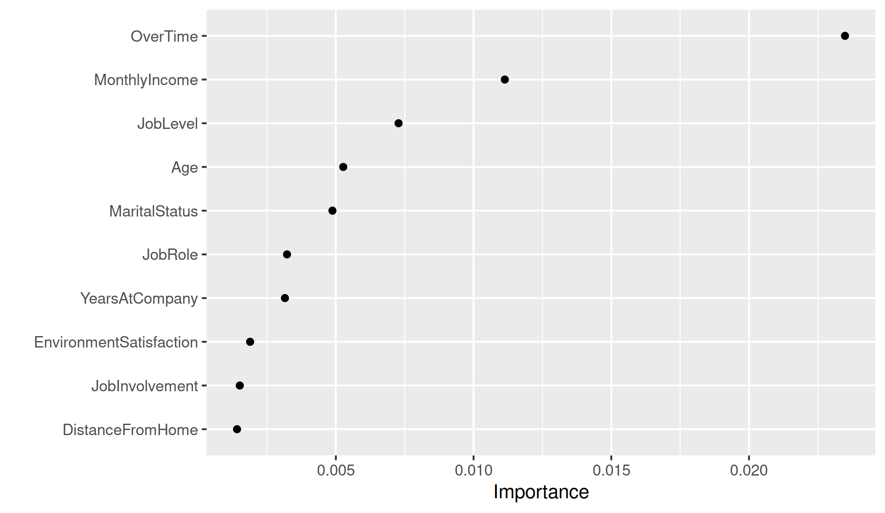
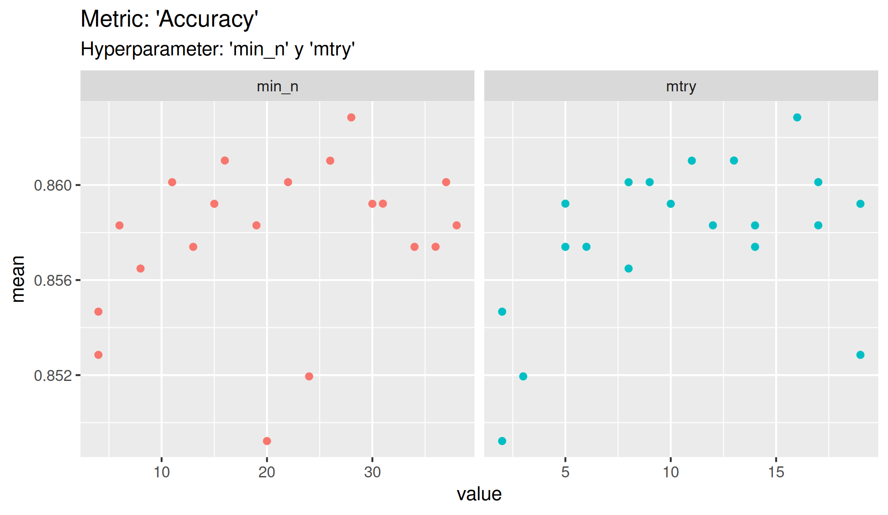

<br/>
<p align="center">
  <a href="https://github.com/jenkins96/RandomForest-Attrition">
    
  </a>

  <h3 align="center">Random Forest Attrition</h3>

  <p align="center">
    Every Project Teach Us Something!
    <br/>
    <br/>
  </p>
</p>

  

## Table Of Contents

* [About the Project](#about-the-project)
* [Built With](#built-with)
* [Getting Started](#getting-started)
  * [Prerequisites](#prerequisites)
  * [Installation](#installation)
* [Usage](#usage)
* [Authors](#authors)


## About The Project
  
Random Forest model with R.  
Data set was obtained from [IBM HR Analytics Employee Attrition & Performance](https://www.kaggle.com/pavansubhasht/ibm-hr-analytics-attrition-dataset) 



## Built With

* R
* RStudio
* tidyverse
* magrittr
* tidymodels
* ranger
* recipes
* randomForest
* caret
* doParallel

## Getting Started
  
Just explore the html file.
If you want to explore the code you can do it in the './script.R' file.

### Prerequisites

None if you just want to explore the html file.
Otherwise, R, RStudio and the libraries are necessary.

### Installation

1. Clone the repo

```sh
git clone https://github.com/jenkins96/RandomForest-Attrition
```

2. Install the required libraries and load them.
  
Just run the code section for the libraries. They will install and load if required.

3. Explore!


## Usage



## Authors

* **Adrian Jenkins** - ** - [Adrian Jenkins](https://github.com/jenkins96/) - **

